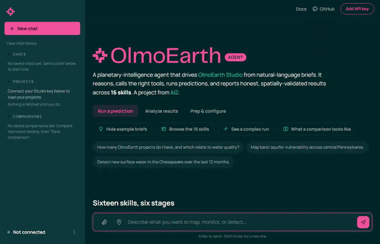

<div align="center">

&nbsp;&nbsp;

**Drive [OlmoEarth Studio](https://allenai.org/blog/olmoearth) from natural-language briefs - on a local LLM, or your own cloud API.**

[](LICENSE)
[](SKILLS.md)
[](https://huggingface.co/unsloth/Qwen3.6-35B-A3B-GGUF)
[](pyproject.toml)

</div>

<div align="center">



</div>

<div align="center"><sub>Connect a Studio key, send a brief, and the agent loop streams its reasoning, tool calls, results, and a plain-English answer -- in a multi-turn chat with saved history, a collapsible Studio project tree, and Markdown answers. &nbsp; | &nbsp; <a href="webui/demo/olmoearth-agent-demo.mp4">walkthrough (MP4)</a></sub></div>

<div align="center"><sub>Demo recorded on <a href="https://github.com/2imi9/OlmoEarth-Agent/releases/tag/v1.0.0">v1.0.0</a>.</sub></div>

---

OlmoEarth Agent turns a natural-language brief into real geospatial work on [OlmoEarth Studio](https://allenai.org/blog/olmoearth). It reasons about the ask, calls tools over a sandboxed Python interpreter, submits and polls predictions, and reports honest results: a provenance manifest per call, mandatory spatial cross-validation on auto-correlated AOIs, and no raw coordinates in chat. It runs on a local **Qwen3.6-35B-A3B** model served with llama.cpp by default (no hosted LLM required), and can optionally use your own **cloud API** key via the web UI's model-backend picker.

## Quick start

> **Prerequisites:** [uv](https://docs.astral.sh/uv/) and an OlmoEarth Studio API key (Studio UI -> profile -> **API Keys**). The **local model** path also needs [Docker](https://docs.docker.com/get-docker/); the **cloud-API** path needs neither Docker nor a download.

Pick the backbone for the agent's reasoning - both drive the same live UI:

**A. Cloud API** (Claude / ChatGPT / Gemini) - no Docker, no 17.7 GB download:

```bash
make setup      # init vendored skills + uv sync --all-extras
make bridge     # live web UI on http://localhost:8088 (no local model needed)
```

Open **http://localhost:8088**, paste your Studio key, then go to **Settings -> LLM backend**, pick a provider, and paste that provider's API key. Both keys stay client-side and are sent per request, never stored server-side. Send a brief.

**B. Local model** (fully offline, free) - one command auto-starts the LLM and the UI:

```bash
make setup      # init vendored skills + uv sync --all-extras
make up         # start the 4-bit Qwen3.6 LLM (first run pulls ~17.7 GB), then the live UI
```

Open **http://localhost:8088**, paste your Studio key, and send a brief. (`make up` is just `make serve` then `make bridge`; run them separately if you prefer.)

**Prefer the terminal?** Run a one-shot brief against the local model instead of the web UI:

```bash
export OLMOEARTH_API_KEY=...   # Studio UI -> profile -> API Keys
make serve && make agent       # make agent runs a sample brief; ask your own with Q="..."
```

`make help` lists every target; `make down` stops the LLM; `make web` serves a backend-free **demo** UI on `:8080`. `LLM_ENDPOINT` defaults to `http://localhost:8000/v1`. No `make` (e.g. Windows + Git Bash)? [`./scripts/quickstart.sh`](scripts/quickstart.sh) runs setup + serve and prints the exact `uv run` commands; see [`docs/serving.md`](docs/serving.md) for the cloud-API setup and the raw `docker compose` invocations.

## What it does

The LLM reads the brief, plans, and emits a tool call; the harness dispatches it as a function-call tool, feeds the result back, and iterates until it can answer. (An opt-in `system:python` subprocess is available for light glue between calls.) The operational rules -- trailing-12-month windows, cost guards on fine-tunes, mandatory spatial CV on auto-correlated AOIs, a provenance manifest per call -- are enforced by the harness, not the model.

The capability set ships as **18 skills**, grouped by EO-workflow stage.

<details>
<summary><strong>The 18 skills</strong>, by workflow stage (Prep / Configure / Run / Analyze / Integrate / Report)</summary>

| # | Skill | What it does | Stage |
|---|---|---|---|
| 1 | `olmoearth-studio-upload` | Labels (GeoJSON/CSV/Shapefile) -> Studio-importable file with MIME / 10K / multi-metric guards | **Prep** |
| 2 | `olmoearth-rslearn-config` | Labels -> `rslearn` `dataset.json` + Lightning YAML with a 7-criteria audit | **Prep** |
| 3 | `olmoearth-studio-job-config` | Task description -> Studio wizard answers, 14 presets + cross-field validator | **Configure** |
| 4 | `olmoearth-embeddings` | Embeddings-vs-fine-tune **guidance** + a runnable-notebook generator (you run the notebook) | **Configure** |
| 5 | `olmoearth-predict` | Core run primitive: submit / poll / fetch results; pixel-value / features follow | **Run** |
| 6 | `olmoearth-change-detect` | Two-or-more-date trajectory diff (refuses naive 2-date diffs) | **Run** |
| 7 | `olmoearth-baseline-compare` | Studio vs. a baseline foundation model, side-by-side on transfer regions | **Run** |
| 8 | `olmoearth-evaluate` | Spatial-block CV + NNDM-LOO over `/prediction-results` | **Analyze** |
| 9 | `olmoearth-similarity` | Exact top-K kNN over OlmoEarth Base embeddings (FAISS = scale-up follow-up) | **Analyze** |
| 10 | `olmoearth-uncertainty` | Repeated pixel-value + Meyer-Pebesma Area of Applicability | **Analyze** |
| 11 | `olmoearth-cloud-mask-audit` | CFMask / s2cloudless / Sen2Cor / MAJA ensemble disagreement | **Analyze** |
| 12 | `olmoearth-qgis-bridge` | Tile URLs -> QGIS WMTS + COG with a sidecar uncertainty raster | **Integrate** |
| 13 | `olmoearth-data-export` | Export Studio projects + predictions to JSON, grouped by project or status | **Integrate** |
| 14 | `olmoearth-provenance` | Manifest wrapper around every API call; emits a replay script | **Report** |
| 15 | `olmoearth-case-narrative` | Stakeholder writeup with live tiles + a freshness gate | **Report** |
| 16 | `olmoearth-litsearch` | arXiv + OpenAlex literature search + DOI/arXiv-id resolution to ground citations | **Report** |
| 17 | `olmoearth-automate` | **One call** that auto-decides embeddings vs fine-tune + proposes a config (reuses #4's logic); optional HuggingFace-dataset introspection | **Configure** |
| 18 | `olmoearth-negative-sampler` | Presence-only labels -> trainable set: generates a buffered, spatially-thinned (optionally embedding-dissimilar) negative class so the data-prep audit passes | **Prep** |

</details>

See [**`docs/SHOWCASE.md`**](docs/SHOWCASE.md) for every skill in action with real outputs -- each driven by the live Qwen3.6 backbone (real reasoning, function calls, and results, not mockups). Per-skill specs are in [`SKILLS.md`](SKILLS.md); the function catalog, harness dataclasses, and operational rules are in [`PLAN.md`](PLAN.md).

## Stack

<details>
<summary><strong>The stack</strong>, layer by layer</summary>

| Layer | What |
|---|---|
| **LLM** | **Default:** [Qwen3.6-35B-A3B](https://huggingface.co/Qwen/Qwen3.6-35B-A3B) (35B total / 3B active, hybrid Gated-DeltaNet + MoE), served locally as a 4-bit GGUF ([`unsloth/Qwen3.6-35B-A3B-GGUF`](https://huggingface.co/unsloth/Qwen3.6-35B-A3B-GGUF) `UD-IQ4_XS`, ~17.7 GB). **Optional:** bring your own **cloud API** key, selected in the web UI (model autodetect; key never stored) |
| **Serving** | [llama.cpp](https://github.com/ggml-org/llama.cpp) (`ghcr.io/ggml-org/llama.cpp:server-cuda`), OpenAI-compatible API, `--jinja` for tool calling: see [`docs/serving.md`](docs/serving.md) |
| **Harness** | A compact catalog of function-call tools + an **opt-in** `system:python` subprocess for light glue, with operational constraints enforced ([`PLAN.md`](PLAN.md)) |
| **Skills** | 18-skill catalog; vendored #1-#4 via submodule `vendor/olmoearth-skills` |
| **Studio API** | `https://olmoearth.allenai.org/api/v1`, Bearer `OLMOEARTH_API_KEY` ([docs](https://docs.olmoearth.allenai.org/)) |

</details>

## Docs & links

- [**PLAN.md**](PLAN.md): the function catalog, harness dataclasses, and operational rules
- [**SKILLS.md**](SKILLS.md): the full 18-skill catalog (Prep / Configure / Run / Analyze / Integrate / Report)
- [**docs/SHOWCASE.md**](docs/SHOWCASE.md): every skill run live, with real outputs
- [**docs/CANON.md**](docs/CANON.md): the canonical facts the repo holds itself to
- [**CONTRIBUTING.md**](CONTRIBUTING.md) | [**CHANGELOG.md**](CHANGELOG.md) | [**AGENTS.md**](AGENTS.md)

## License

[OlmoEarth Artifact License](LICENSE) (Ai2) - free use with restrictions: no military/defense/surveillance or extractive uses; cite Ai2 and propagate the terms downstream. Matches [`allenai/olmoearth_pretrain`](https://github.com/allenai/olmoearth_pretrain/blob/main/LICENSE).

<div align="center"><sub>Built on OlmoEarth Studio by Ai2. A research demo, not an official product.</sub></div>
