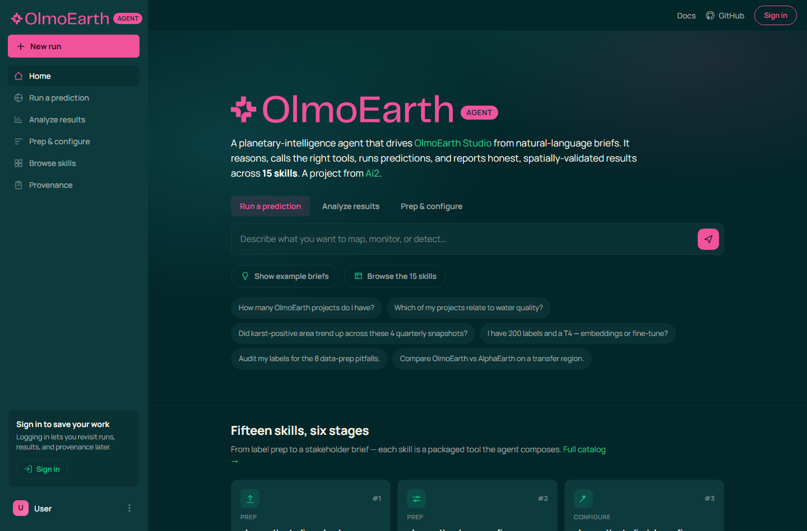

# OlmoEarth Agent — web UI

A front-end shell for the OlmoEarth Agent, styled after [Ai2 **Asta**](https://asta.allen.ai/)
(dark-teal canvas, cream text, Manrope, a centered prompt hero, a left sidebar)
and rebranded with **OlmoEarth** elements (the pink Ai2/OlmoEarth logo, the
EO/Studio content, the 15-skill catalog).

It's a **static mock** — no build step, no framework, no tracking. The prompt,
tabs, example briefs, and the "what a run looks like" transcript are illustrative;
wiring it to the live agent is the next step (see below).



## View it

```bash
# from the repo root
python -m http.server 8000 --directory webui
# then open http://localhost:8000
```

Or just open `webui/index.html` in a browser.

## Files

| File | What |
|---|---|
| `index.html` | markup — sidebar, prompt hero, capability grid, example transcript, footer |
| `styles.css` | the design system (tokens at `:root`) — no preprocessor |
| `app.js`     | renders the 15 skill cards + tab / example / mobile-menu interactions |
| `assets/OlmoEarth-logo.png` | the official OlmoEarth wordmark |
| `screenshots/` | reference renders (desktop, transcript, mobile) |

## Design

Palette and type were taken from Asta's *computed* styles (not guessed):
dark teal **`#032629`**, cream **`#faf2e9`**, **Manrope**, and Asta's emerald
**`#0FCB8C`** kept as a secondary accent. The **primary accent is OlmoEarth
pink `#F0529C`** (the brand) — so it reads as Asta's calm, minimal aesthetic but
unmistakably OlmoEarth. See [`DESIGN_NOTES.md`](DESIGN_NOTES.md).

Responsive: the sidebar collapses to a hamburger and the card grid reflows to a
single column below 880 px.

## Status & next step

This is the **visual shell**. To make it live, point the prompt form at the
agent loop — `olmoearth_agent.harness.LeadAgent` already turns a brief into a
tool-call trace; a thin HTTP endpoint (FastAPI) streaming those steps would
populate the transcript for real.

*Styling inspired by Ai2 Asta. This is a research-demo UI, not an official
product page.*
